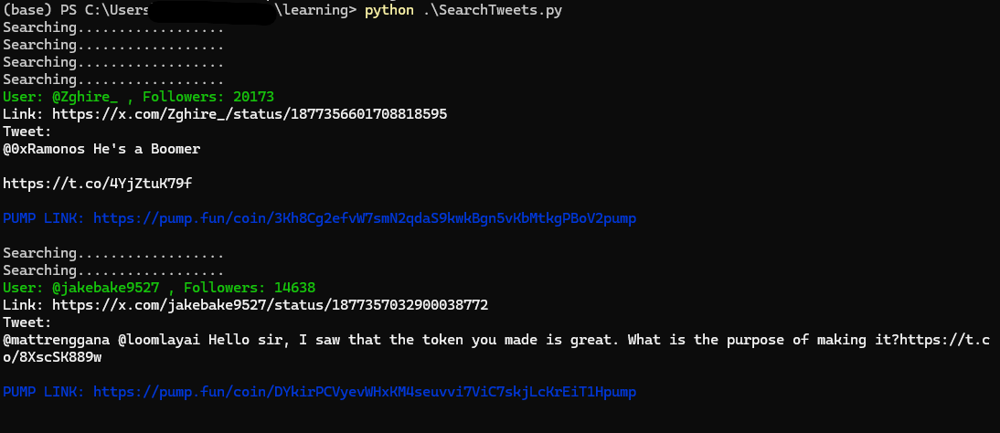

# PumpTweets
 

**Python 3.12.4**

This script retrieves the latest tweets containing "pump.fun" links using the `twikit` API, incorporating custom filters to identify potential pumps.

## Features

*   Searches for tweets containing specific keywords ("pump.fun/", "pump", "wallet").
*   Filters tweets based on:
    *   User verification status (blue verified badge).
    *   Minimum number of followers.
    *   Presence of "pump.fun" links and/or Solana addresses.
*   Plays an alert sound when a relevant tweet is found.

## Setup

1.  **Install required libraries:**

    ```bash
    pip install twikit httpx termcolor
    ```

2.  **Run `login.py`:**

    *   This script logs in to Twitter using your credentials (replace placeholders with your actual username, email, and password) and saves the cookies to `cookies.json`.

3.  **Run `SearchTweets.py`:**

    *   This script loads the saved cookies, searches for tweets based on the defined criteria, and displays the filtered tweets along with their relevant information (links, addresses, etc.).

## Usage

1.  Make sure you have Python 3.12.4 installed.
2.  Clone this repository.
3.  Update the placeholders in `login.py` with your Twitter credentials.
4.  Run `python login.py` to generate `cookies.json`.
5.  Run `python SearchTweets.py` to start the tweet monitoring process.

**Note:** The script includes a mechanism to handle Twitter's rate limits. If you encounter a rate limit error, the script will wait for the reset time before continuing.

## Screenshot


